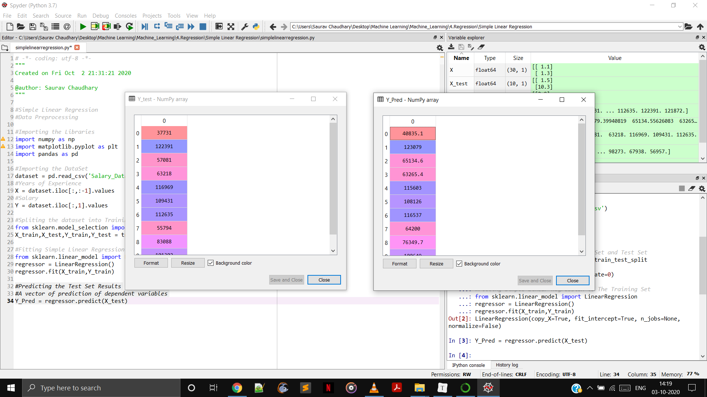

# Salary-Predicter
A model based on simple linear regression to predict the salaries based on the experience.We are going to use the specific library linear model that will do the job for us.Using the regressor object we call a method of this class .fit which accepts salary and year of experience training data as a parameter. Here years of experience is the independent variable and salary is the dependent variable.

This will not only create a simple regressor but also it will make our model to learn the correlations between the training set and testing set of data. It learns how to predict the dependent variable which is the salary based on the information of the independent variable which is the numbers of years of experience.

```python
#Predicting the Test Set Results
#A vector of prediction of dependent variables
Y_Pred = regressor.predict(X_test)
```


>  So we can see above , on the left side we have the original salaries and on the right side we have the predicted salaries. 
>
> Our predicted salaries arent so far from the original salary in most the cases. In some case it might get a prediction which is far from reality . 


